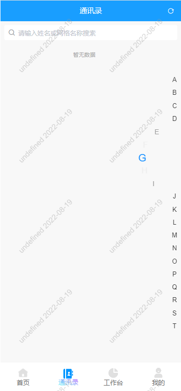

# uniapp-renderjs
uni app renderjs以及worker使用，代码不能直接使用，只做示例，代码中存在对renderjs，worker理解不到位，使用复杂化的问题。


## 通讯录索引效果



可以按住索引下上移动，字母会呈现半圆轮转


## 背景

做一个通讯录右侧的索引功能，需要监听touch事件，页面展示一些效果，于是使用了renderjs；通讯录所有数据一次性返回，需要处理成数结构和实现搜索功能，在renderjs里使用worker实现，提高页面流畅性


## renderjs uni app官方描述

`renderjs`是一个运行在视图层的js

`renderjs`的主要作用有2个：

- 大幅降低逻辑层和视图层的通讯损耗，提供高性能视图交互能力
- 在视图层操作dom，运行for web的js库

### 注意事项

- 目前仅支持内联使用。
- 不要直接引用大型类库，推荐通过动态创建 script 方式引用。
- 可以使用 vue 组件的生命周期不可以使用 App、Page 的生命周期
- 视图层和逻辑层通讯方式与 [WXS](https://uniapp.dcloud.net.cn/tutorial/miniprogram-subject.html#wxs) 一致，另外可以通过 this.$ownerInstance 获取当前组件的 ComponentDescriptor 实例。
- 观测更新的数据在视图层可以直接访问到。
- APP 端视图层的页面引用资源的路径相对于根目录计算，例如：./static/test.js。
- APP 端可以使用 dom、bom API，不可直接访问逻辑层数据，不可以使用 uni 相关接口（如：uni.request）
- H5 端逻辑层和视图层实际运行在同一个环境中，相当于使用 mixin 方式，可以直接访问逻辑层数据。


## worker

worker通过新建一个后台线程执行js代码，从而使js代码的执行不影响用户界面，具体可以参考mdn https://developer.mozilla.org/en-US/docs/Web/API/Web_Workers_API/Using_web_workers

当涉及到复杂的js计算或者大量数据处理，推荐使用worker。


## 简介

- 当需要和视图层频繁交互的时候，可以使用renderjs。

- 添加一个renderjs script模块
```html
  <script module="worder" lang="renderjs">
  	export default {
  		data(){
  			return {
  			}
  		},
  		mounted() {
  		},
  		methods: {
              emitMsg(nValue,oValue,ownerInstance,vm){

              }
      	}
      }
  </script>
```
- 在页面某个元素上绑定一个属性到vue的data，添加这个属性的变化监听

  ```html
  <view :propname="code" :change:propname="worder.emitMsg" class='bg-white page '>
  ```


- code变化将会调用renderjs的emitMsg方法，可以通过ownerInstance调用原来vm里面的methods

  ```javascript
  ownerInstance.callMethod('workerInitData',{
  
  })
  ```

- 注意

  - h5端其实renderjs和你原来写的是合并在一起的，所以不要定义相同的名字，防止冲突
  - 监听的vue里变化的变量，renderjs可以直接通过this变量名访问


## 通讯录索引使用

- 引用letterIndex组件

  ```javascript
  import letterIndex from '@/components/letterIndex.vue'
  export default {
      components:{
          letterIndex,
      }
  }
  ```

- 添加组件到页面

  ```html
  <view class="flex" style="height:100%;">
  	<view style="width:0;flex-grow:1;"></view>
  	<letterIndex @letterChange="letterChange" ref="letterIndex"></letterIndex>
  </view>
  ```

- 初始化letterIndex组件，需要在mounted后

  ```javascript
  /*@param
  	list: Array 索引数组，例如['A','B','C']，['陆'，‘张’,'王']，中文的索引未经过测试
  	guid: Any 唯一标识，用户当前按住的索引，回调时也会带上这个标识，异步的renderjs可能出现，实际索引已经被重新初始化，使用guid判断回调是否有效，可以不传
  	initF: Function 函数接收一个参数，就是letterIndex vue的this，可以通过this改变letterIndex的样式，
  		this.fz = 16;//修改letter字体大小，单位px
  		this.ewp = 2;//修改letter索引的宽和高，单位是em
  		this.mFz = 24;//修改letter选中索引的字体大小
  		this.fn = 7;//修改letter旋转轮盘由几个索引组成
  */
  //直接传递索引数组给组件
  this.$refs.letterIndex.initPyList(list,guid,initF)
  
  //或者使用以下方法，传递一个数据数组，自动生成ABC...的索引
  /*@param
  	list: Array 索引数组，例如[{name:'陆磊'},{name:'卡卡'},{name:“思思”}]
  	name: String list数组中用来生成索引的属性
  	model: Boolean 生成索引是否启用姓模式，姓模式会多一些作为姓的多音字做特殊处理，使用作为姓时候的音
  	onlyGet: Boolean 是否只返回处理后的数据，不对组件进行初始化
  	guid: 同上
  	initF: 同上
  	
    @return
    	Object {
    		pyList:Array //索引数组
    		data:Array<Object {
    			key: String //索引
    			value:Array//这个索引对应的数据数组
    		}>
    	}
  */
  initList(list,name,model,onlyGet,guid,initF)
  ```

- 在页面上当前选中的索引变化（会有延迟，是为了省去用户连续移动的中间部分），会触发vue letterChange事件

  ```javascript
  /*
  	事件参数
  	Object {
  		letter: String//当前选中所有
  		guid: Any//当前初始化数据的唯一标识
  	}
  */
  ```


## 其他

项目里还包含了一些其他代码

- 部分使用的工具类方法
- uni app顶部导航栏的多端兼容
- uni.request的封装
- html5+请求app权限
